# Lab 03 - Proyecto Quiz Django

**Integrante:** Angel Rosales

**Fecha:** Septiembre 04, 2026

---

## Paso 1: Estructura del Proyecto

Se creó el proyecto con la siguiente estructura:

```
Default Project/
├── quiz_venv/          # Entorno virtual
├── quiz/               # Aplicación Django
│   ├── admin.py
│   ├── apps.py
│   ├── forms.py
│   ├── migrations/
│   ├── models.py
│   ├── tests.py
│   ├── urls.py
│   └── views.py
├── quiz_project/       # Configuración del proyecto
│   ├── __init__.py
│   ├── asgi.py
│   ├── settings.py
│   ├── urls.py
│   └── wsgi.py
├── templates/          # Plantillas
│   ├── base.html
│   └── quiz/
│       ├── add_question.html
│       ├── exam_detail.html
│       └── exam_list.html
├── .gitignore
├── manage.py
├── requirements.txt
└── db.sqlite3
```

**requirements.txt:**
```
Django==6.1.1
```

La aplicación `quiz` está declarada en `INSTALLED_APPS` dentro de `quiz_project/settings.py`.

---

## Paso 2: Modelo Exam

```python
class Exam(models.Model):
    title = models.CharField(max_length=200)
    description = models.TextField()
    created_at = models.DateTimeField(auto_now_add=True)

    def __str__(self):
        return self.title
```

---

## Paso 3: Modelos Question y Choice

```python
class Question(models.Model):
    exam = models.ForeignKey(Exam, on_delete=models.CASCADE, related_name='questions')
    text = models.TextField()

    def __str__(self):
        return f"Q{self.id}: {self.text[:50]}..."

class Choice(models.Model):
    question = models.ForeignKey(Question, on_delete=models.CASCADE, related_name='choices')
    text = models.CharField(max_length=500)
    is_correct = models.BooleanField(default=False)

    def __str__(self):
        return f"{self.text[:50]}... (Correct: {self.is_correct})"
```

---

## Paso 4: Clases Meta

```python
class Meta:
    # Exam
    ordering = ['title']
    verbose_name = 'Examen'
    verbose_name_plural = 'Exámenes'

    # Question
    ordering = ['pk']
    verbose_name = 'Pregunta'
    verbose_name_plural = 'Preguntas'

    # Choice
    ordering = ['pk']
    verbose_name = 'Opción'
    verbose_name_plural = 'Opciones'
```

---

## Paso 5: Migraciones

### Generar migraciones:
```bash
python manage.py makemigrations quiz
```

**Salida:**
```
Migrations for 'quiz':
  quiz/migrations/0001_initial.py
    + Create model Exam
    + Create model Question
    + Create model Choice
    + Add field exam to question
    + Add field question to choice
```

### Aplicar migraciones:
```bash
python manage.py migrate
```

**Salida:**
```
Operations to perform:
  Apply all migrations: admin, auth, contenttypes, quiz, sessions
Running migrations:
  Applying quiz.0001_initial... OK
```

**Tablas creadas en la base de datos:**
- `quiz_exam` (id, title, description, created_at)
- `quiz_question` (id, text, score, exam_id)
- `quiz_choice` (id, text, is_correct, question_id)

---

## Paso 6: Formularios

```python
class ExamForm(forms.ModelForm):
    class Meta:
        model = Exam
        fields = ['title', 'description']

class QuestionForm(forms.ModelForm):
    class Meta:
        model = Question
        fields = ['text']

ChoiceFormSet = inlineformset_factory(
    Question,
    Choice,
    form=forms.ChoiceForm,
    fields=['text', 'is_correct'],
    extra=4,
    can_delete=True
)
```

---

## Paso 7: Vistas

```python
from django.db import transaction

def exam_list(request):
    exams = Exam.objects.all().order_by('-created_at')
    return render(request, 'quiz/exam_list.html', {'exams': exams})

def exam_detail(request, pk):
    exam = get_object_or_404(Exam, pk=pk)
    return render(request, 'quiz/exam_detail.html', {'exam': exam})

@transaction.atomic
def add_question(request, pk):
    exam = get_object_or_404(Exam, pk=pk)
    question_form = QuestionForm(request.POST or None)
    choice_formset = ChoiceFormSet(request.POST or None)

    if question_form.is_valid() and choice_formset.is_valid():
        question = question_form.save()
        choices = choice_formset.save(commit=False)
        correct_count = sum(1 for c in choices if c.is_correct)
        if correct_count != 1:
            raise forms.ValidationError("Exactly one choice must be correct.")
        for choice in choices:
            choice.question = question
            choice.save()
        return redirect('exam_detail', pk=exam.pk)

    return render(request, 'quiz/add_question.html', {
        'exam': exam,
        'question_form': question_form,
        'choice_formset': choice_formset
    })
```

---

## Paso 8: URLs y Plantillas

### quiz/urls.py
```python
from django.urls import path
from . import views

urlpatterns = [
    path('', views.exam_list, name='exam_list'),
    path('exam/<int:pk>/', views.exam_detail, name='exam_detail'),
    path('exam/<int:pk>/add-question/', views.add_question, name='add_question'),
]
```

### Plantillas creadas:
- `templates/base.html` - Plantilla base
- `templates/quiz/exam_list.html` - Listado de exámenes
- `templates/quiz/exam_detail.html` - Detalle con preguntas y opciones
- `templates/quiz/add_question.html` - Formulario con formset

---

## Paso 9: Admin y Datos Demo

### registration en admin.py:
```python
class ChoiceInline(admin.TabularInline):
    model = Choice
    extra = 4

class QuestionInline(admin.TabularInline):
    model = Question
    extra = 1

@admin.register(Exam)
class ExamAdmin(admin.ModelAdmin):
    list_display = ('title', 'created_at')
    search_fields = ('title', 'description')
    inlines = [QuestionInline]

@admin.register(Question)
class QuestionAdmin(admin.ModelAdmin):
    list_display = ('id', 'exam', 'score')
    list_filter = ('exam',)
    inlines = [ChoiceInline]

@admin.register(Choice)
class ChoiceAdmin(admin.ModelAdmin):
    list_display = ('id', 'question', 'text', 'is_correct')
    list_filter = ('is_correct', 'question__exam')
```

### Datos de demostración:
- 1 Examen: "Examen de Python"
- 2 Preguntas con 4 opciones cada una
- 1 respuesta correcta por pregunta

---

## Paso 10: Campo Score

### Migración generada: `0002_question_score.py`

```python
migrations.AddField(
    model_name='question',
    name='score',
    field=models.IntegerField(default=1, help_text='Points awarded for answering this question correctly'),
),
```

La instrucción `AddField` añade el campo `score` como `IntegerField` con valor por defecto de 1.

---

## Paso 11: Justificación de Tipos de Campo

### Modelo Exam

| Campo | Tipo | Justificación |
|-------|------|---------------|
| title | `CharField(max_length=200)` | Texto corto con límite conocido. Optimizado para índices y validación automática del límite de caracteres. |
| description | `TextField()` | Contenido extenso sin límite predecible. Diseñado para textos largos como explicaciones detalladas. |
| created_at | `DateTimeField(auto_now_add=True)` | Timestamp automático al crear. UTC para consistencia temporal. Permite orden cronológico. |

### Modelo Question

| Campo | Tipo | Justificación |
|-------|------|---------------|
| exam | `ForeignKey(Exam, on_delete=CASCADE)` | Relación muchos-a-uno. CASCADE mantiene integridad referencial al eliminar exámenes. |
| text | `TextField()` | Enunciados variables en longitud. Sin límite impuesto, almacena contenido completo. |
| score | `IntegerField(default=1)` | Puntos enteros. Eficiente (4 bytes), permite operaciones aritméticas para puntajes totales. |

### Modelo Choice

| Campo | Tipo | Justificación |
|-------|------|---------------|
| question | `ForeignKey(Question, on_delete=CASCADE)` | Relación muchos-a-uno. Cada opción pertenece a una sola pregunta. |
| text | `CharField(max_length=500)` | Opción de respuesta con límite razonable. Validación automática del tamaño. |
| is_correct | `BooleanField(default=False)` | Valor binario verdadero/falso. Eficiente (1 byte). default=False previene marcas accidentales. |

---

## Paso 12: Repositorio

**URL del repositorio:** https://github.com/AngelRosales78/Lab03_empresarial

### Instalación:
```bash
git clone https://github.com/AngelRosales78/Lab03_empresarial.git
cd "Default Project"
quiz_venv\Scripts\Activate.ps1
py manage.py runserver
```

### URL de la aplicación:
- Listado de exámenes: http://127.0.0.1:8000/
- Detalle de examen: http://127.0.0.1:8000/exam/1/
- Admin: http://127.0.0.1:8000/admin/

---

## Capturas de Pantalla

> **Nota:** Reemplazar cada `[INSERTAR CAPTURA AQUI]` con la imagen correspondiente tomada durante la ejecución del laboratorio.

### Captura - Paso 1: Estructura del Proyecto


### Captura - Paso 2: Modelo Exam


### Captura - Paso 3: Modelos Question y Choice


### Captura - Paso 4: Clases Meta


### Captura - Paso 5: Migraciones


### Captura - Paso 6: Formularios


### Captura - Paso 7: Vistas
- Listado de exámenes: 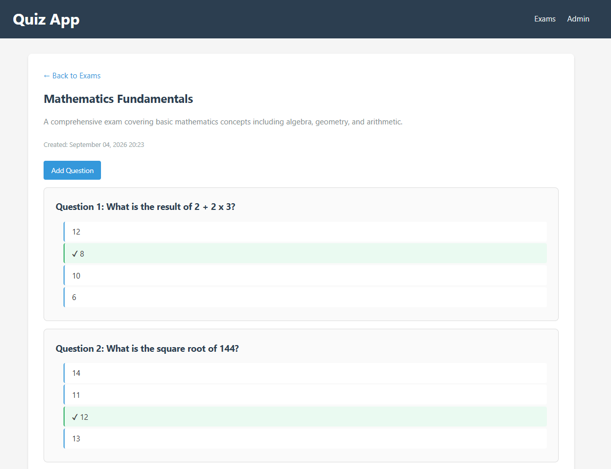
- Detalle de examen: 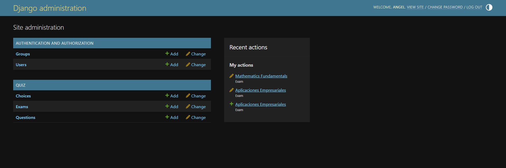
- Alta de pregunta: 

### Captura - Paso 8: URLs y Plantillas


### Captura - Paso 9: Admin y Datos Demo
- Panel admin: 
- Inlines: 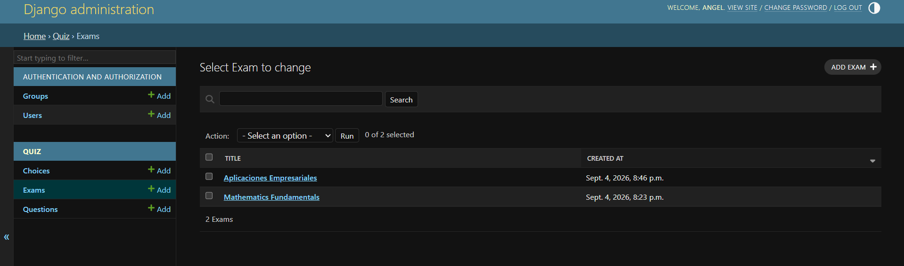
- Examen: 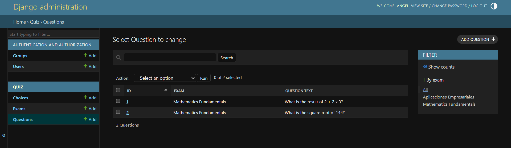
- Preguntas: 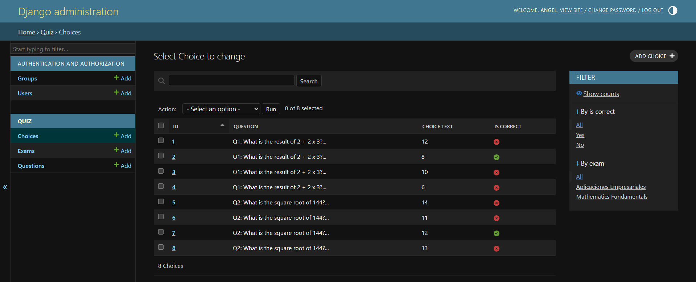
- Opciones: 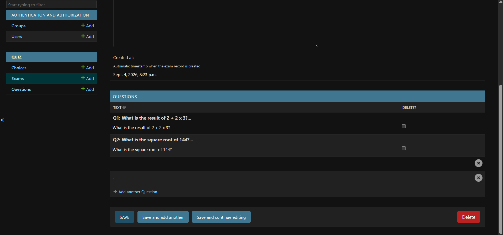

### Captura - Paso 10: Campo Score
- Archivo de migración: 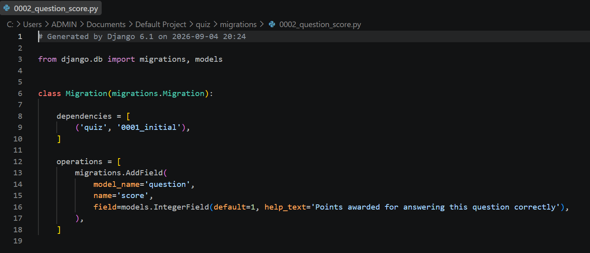
- Campo en admin: 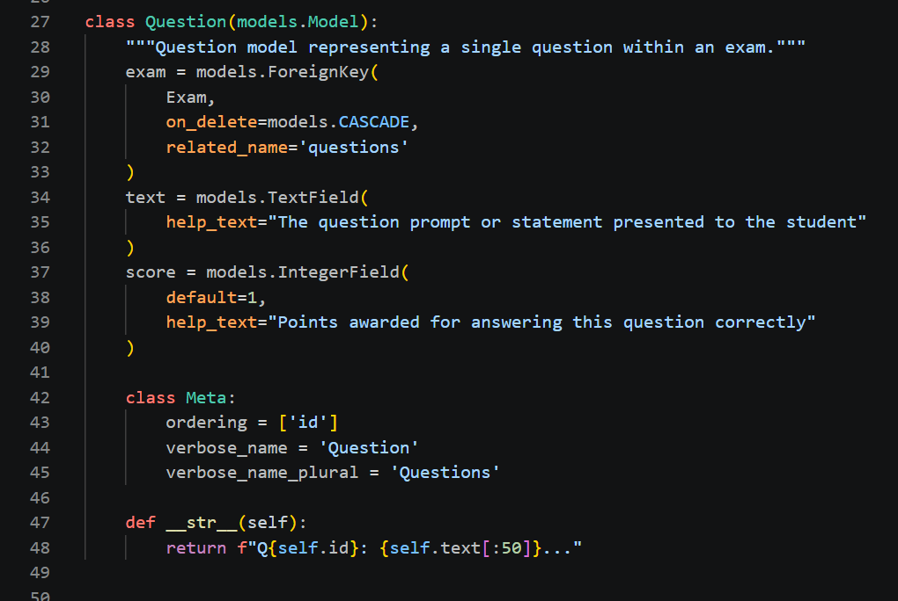

### Captura - Paso 11: Justificaciones
- Justificaciones modelo Exam: 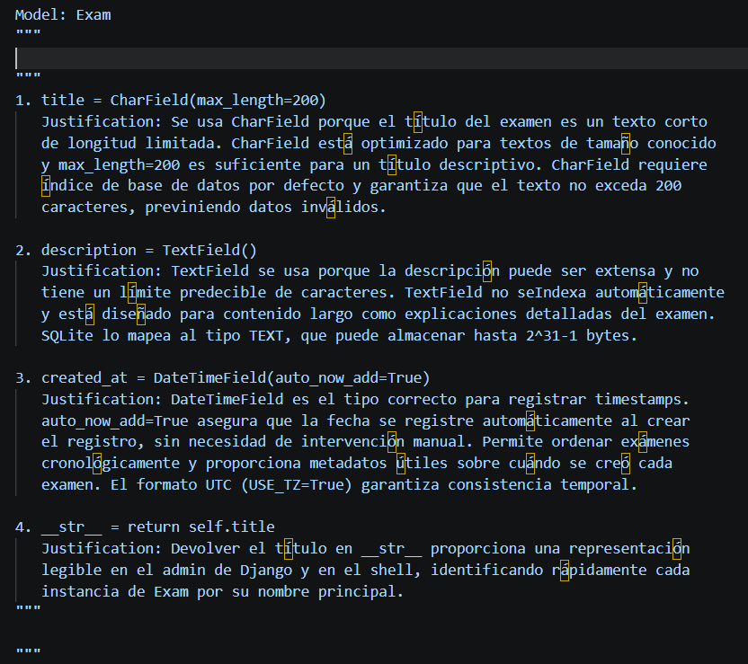
- Justificaciones modelo Question: 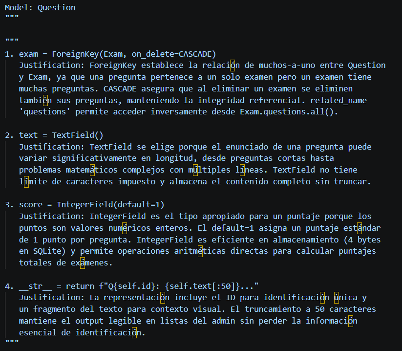
- Justificaciones modelo Choice: 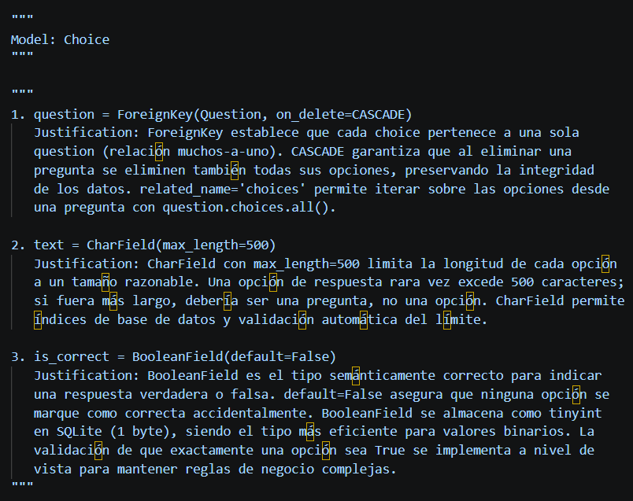

---

## Notas Técnicas

- **Django Version:** 6.1.1
- **Python Version:** 3.14.0
- **Base de Datos:** SQLite3 (db.sqlite3)
- **Autenticación:** Variables de entorno para SECRET_KEY (con fallback para desarrollo)
- **Código:** English (comments + code)
- **Entregable:** Spanish
